# My Certificates

Certifications I have earned from a variety of sources.

## Table of Contents

>- [Certificates](#certificates)

>- [Certificate Images](#certificate-images)

## Certificates

| Certificate Name           | Description                                                                                                                                                                                                                                                                                                                                                                                                                                                                                                                                                                                                                                    | Date Earned  | Issuing Institution |
| --------------------------|-----------------------------------------------------------------------------------------------------------------------------------------------------------------------------------------------------------------------------------------------------------------------------------------------------------------------------------------------------------------------------------------------------------------------------------------------------------------------------------------------------------------------------------------------------------------------------------------------------------------------------------------------| ------------ | ------------------ |
| [Python for Beginners](Pages/PythonForBeginners.html) | Introduces the basics of programming in Python, including variables, data types, control structures, functions, and file input/output. | August 25, 2022 | Sololearn |
| [Intermediate Python](Pages/IntermediatePython.html) | Builds on the foundational concepts covered in the Python for Beginners course, and delves deeper into topics such as object-oriented programming, regular expressions, and error handling. | January 29, 2023 | Sololearn |
| [Python Core](Pages/PythonCore.html) | Covers advanced topics in Python programming, including iterators, generators, decorators, and metaclasses. | January 31, 2023 | Sololearn |
| [Python Data Structures](Pages/PythonDataStructures.html) | Teaches various data structures and algorithms in Python, including lists, tuples, dictionaries, sets, and sorting algorithms. | January 31, 2022 | Sololearn |
| [Python for Finance](Pages/PythonForFinance.html) | Focuses on using Python for financial analysis, including working with stock prices, portfolio optimization, and risk management. | February 4, 2023 | Sololearn |
| [Ruby](Pages/Ruby.html) | Introduces the basics of programming in Ruby, including variables, data types, control structures, functions, and object-oriented programming. | January 29, 2023 | Sololearn |
| [SQL](Pages/SQL.html) | Covers the basics of SQL, including creating tables, querying data, and working with multiple tables. | February 4, 2023 | Sololearn |
| [HTML](Pages/HTML.html) | Covers the basics of HTML, including creating web pages, formatting text, and working with images and links. | February 5, 2023 | Sololearn |
| [Golang](Pages/Go.html) | Introduces the basics of programming in Golang, including variables, data types, control structures, functions, and concurrency. | February 10, 2023| Sololearn |
| [Web Development Fundamentals](Pages/WebDevelopmentFundamentals.html) | Covers the basics of web development, including HTML, CSS, and JavaScript, as well as basic concepts such as responsive design and accessibility. | February 11, 2023| Sololearn |
| [Complete Python Mastery](Pages/CompletePythonMastery.html) | Covers a complete overview of Python including basic concepts such as variables, data types, control structures, and functions. Dives deeper into more advanced topics including app and web development with Django and Machine Learning. | March 7, 2023 | Code With Mosh|
| [R](Pages/R.html) | Learned the basics of R, see how to create programs that store & manipulate data, as well as perform data analysis tasks using various data sets and visualize the results using graphs and charts. | March 7, 2023 | Sololearn |
| [Tech for Everyone](Pages/Tech.html) | Understanding technology makes it easier and giving you a competitive advantage. Explores what exactly is the Internet, How does it work, what opportunities can you find online. | March 9, 2023 | Sololearn | 
| [SQL Intermediate](Pages/SQLIntermediate.html) | Dives deeper into SQL going over more concepts such as UNION, JOIN, and CASE. | March 12, 2023 | Sololearn |
| [Level Up Advanced Python](Pages/LevelUpAdvancedPython.html) | LinkedIn  space with Python coding challenges to test your understanding of advanced Python concepts, following along with instructor Jonathan Fernandes, a results-driven data science consultant. | March 20, 2023 | LinkedIn Learning |
| [Python Object-Oriented-Programming](Pages/PythonOOP.html) | LinkedIn space on learning how to apply core OOP principles like inheritance and composition along with some Python-specific features like “magic” methods and data classes to build programs that are extensible and efficient. | March 23, 2023 | LinkedIn Learning |
| [Python Decorators](Pages/PythonDecorators.html) | In this LinkedIn space course, Jonathan Fernandes explains what decorators are and why they are used so extensively in production projects. He explains how to solve common challenges associated with decorators, such as debugging; how to chain decorators; how to use decorators with classes; and how to access the arguments passed into decorated functions. | March 23, 2023 | LinkedIn Learning |
| [PHP](Pages/PHP.html) | In this course we learn how to create dynamic web pages, develop websites, and generate dynamic content. | April 4, 2023 | Sololearn |
| [Should Know](Pages/ShouldKnow.html) | This course helps you on the journey to writing intermediate-level Python code. Instructor Jonathan Fernandes presents eight things that you should know how to do in Python. Topics include the Python any() and all() methods, using enumerate() and zip() methods, min() and max(), and more. For each topic, Jonathan provides a hands-on approach and then gives you a challenge (with solutions) to practice. | April 12, 2023 | LinkedIn Learning |

## Certificate Images

  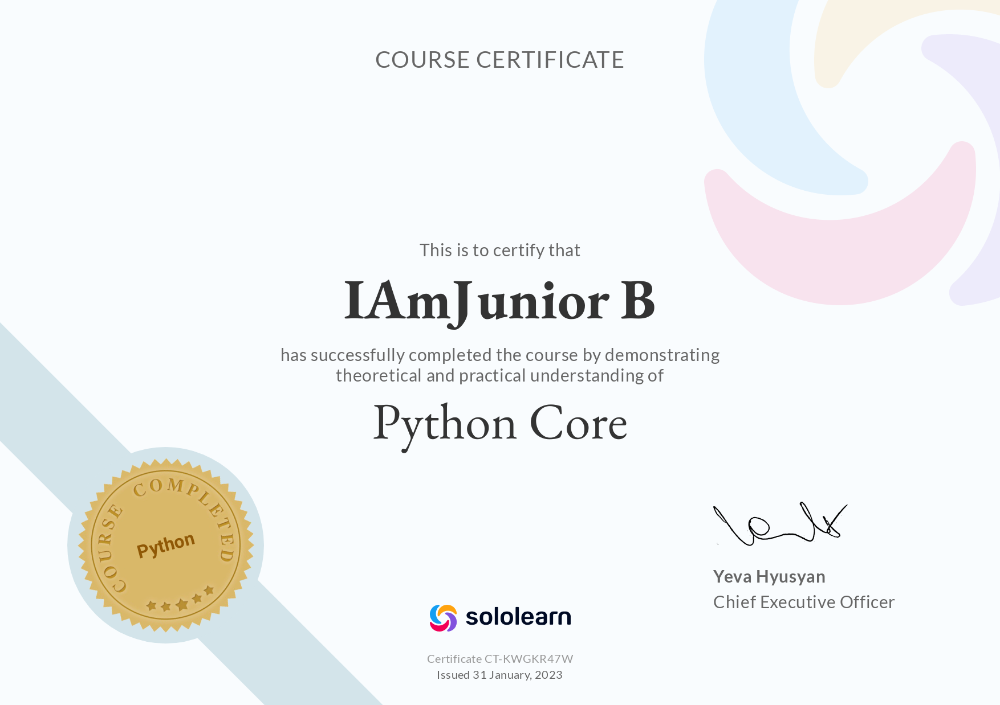 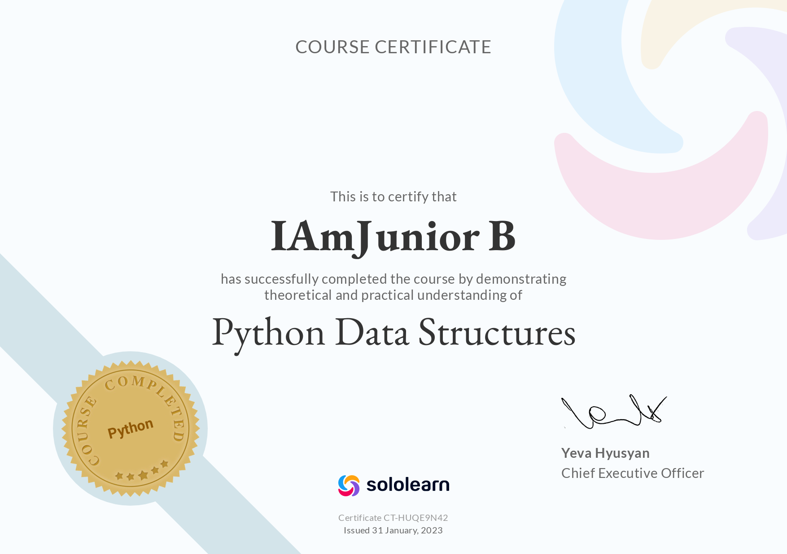 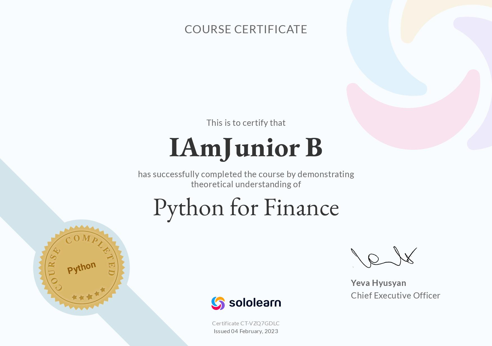

    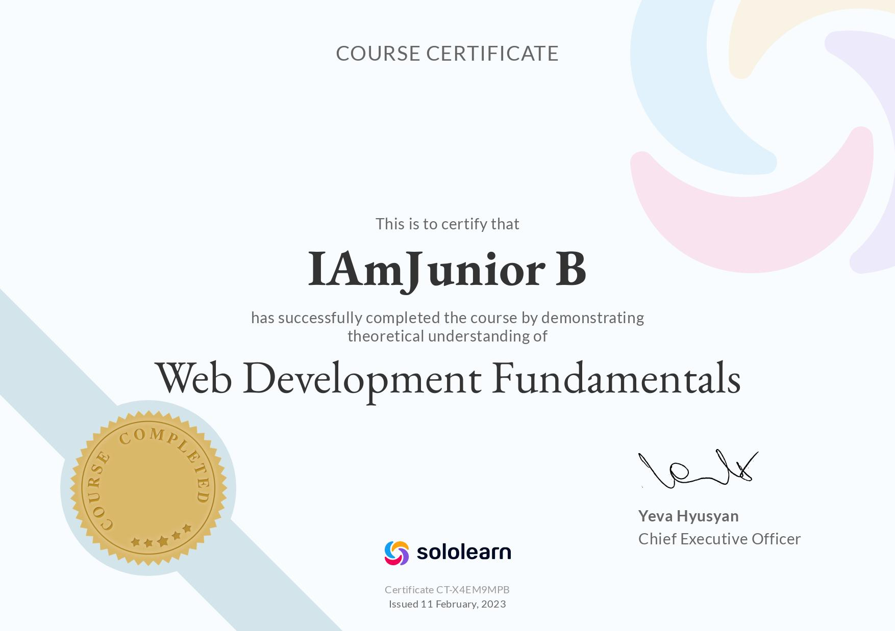 

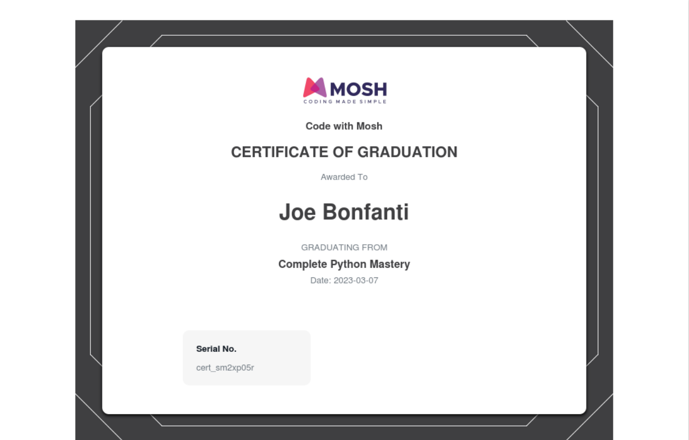 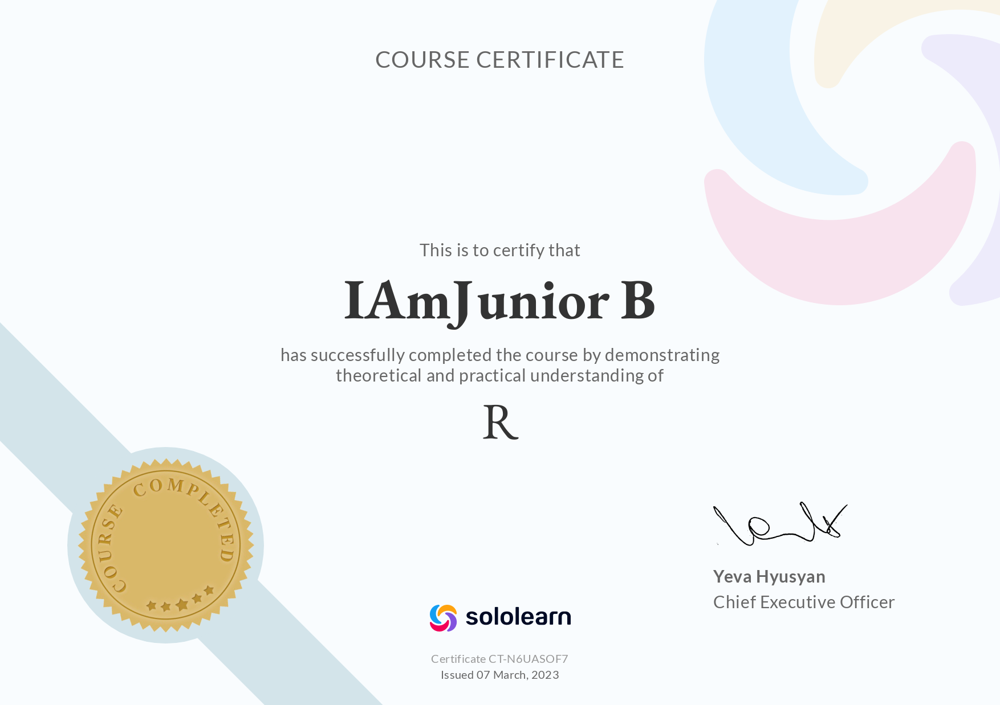  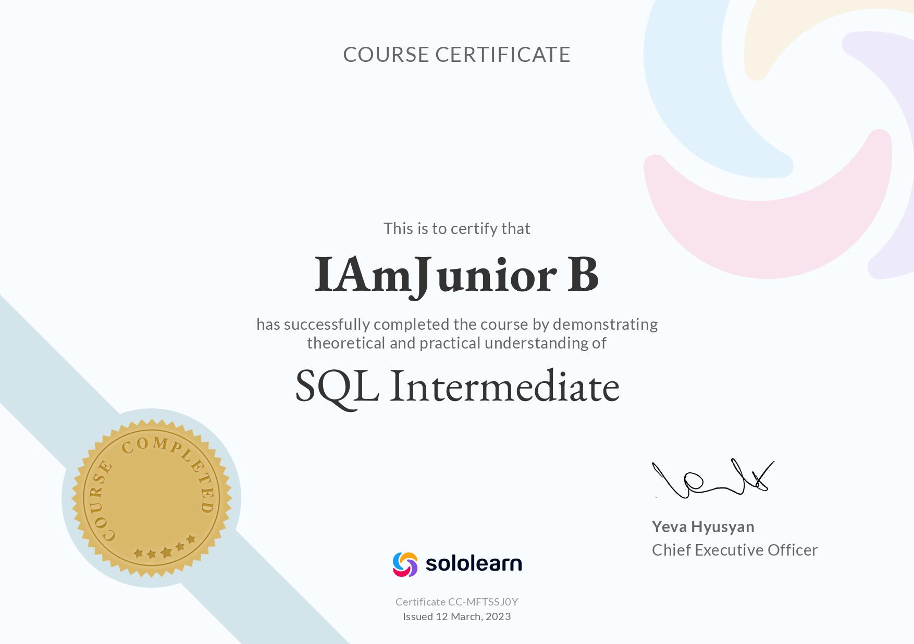 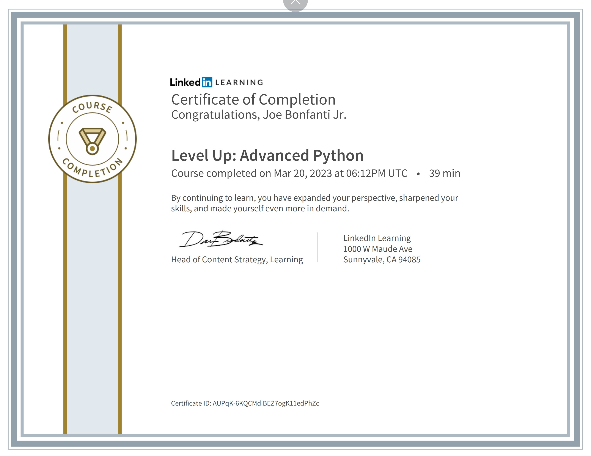

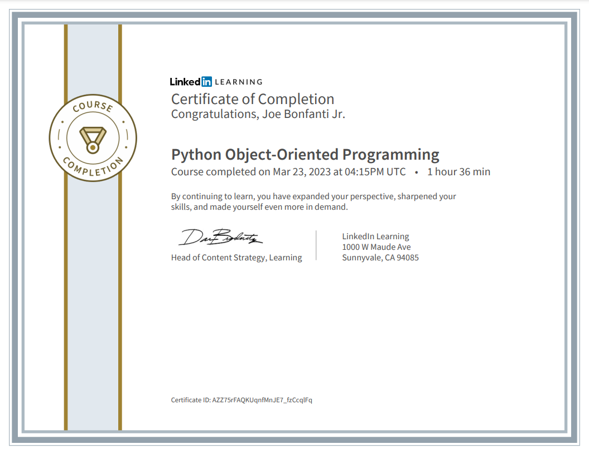 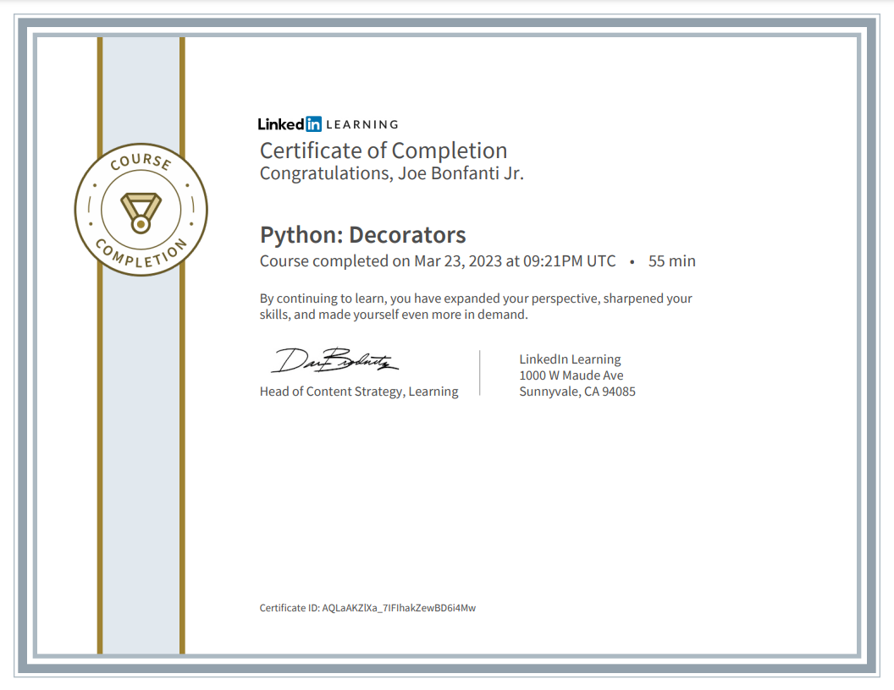 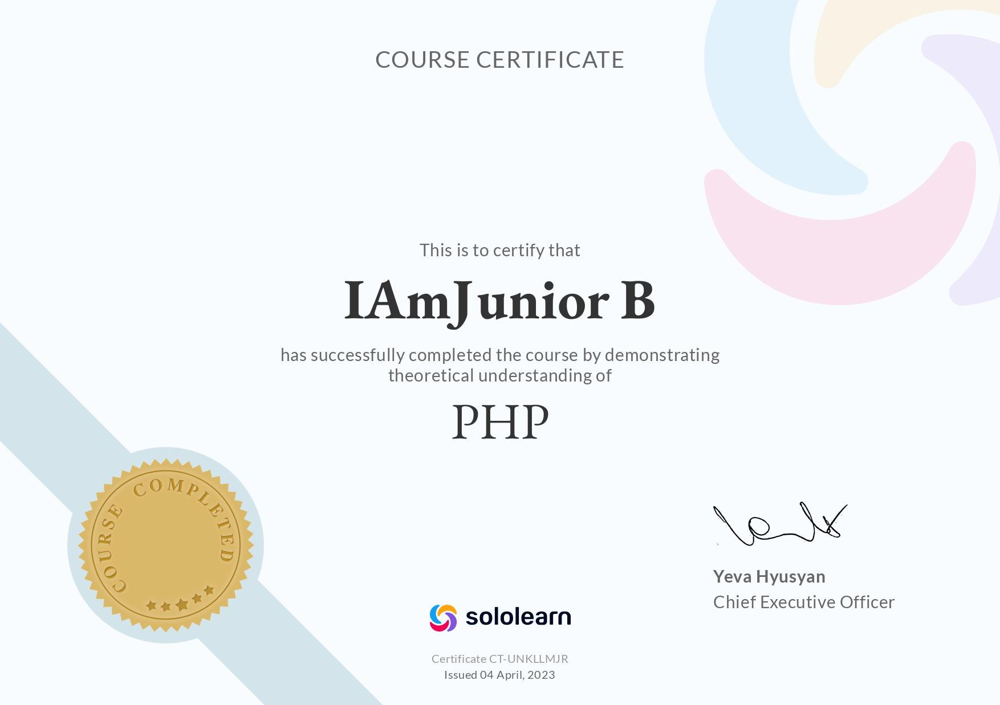 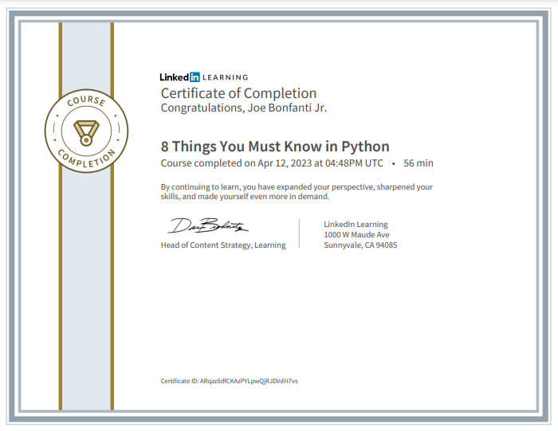
